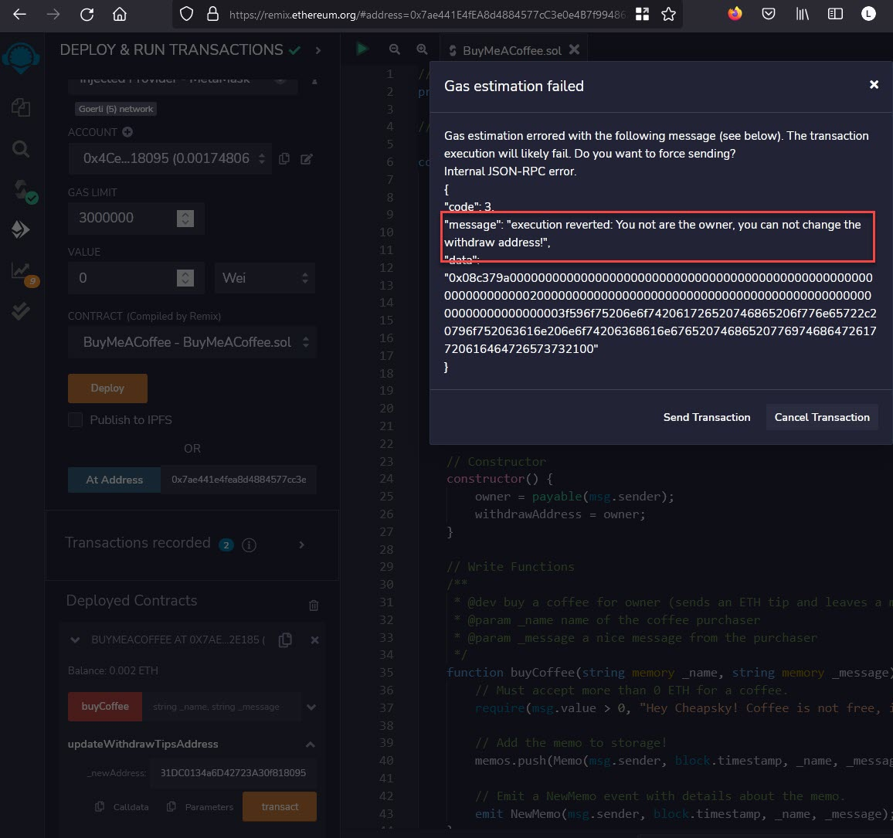

#  Road to web3 - week 2 - backend

:book: [Alchemy University](https://docs.alchemy.com/docs/how-to-build-buy-me-a-coffee-defi-dapp): How to Build "Buy Me a Coffee" DeFi dapp

#### Proof ☕

:globe_with_meridians: [Deployed a 'Buy Me A Coffee' Smart Contract on goerli testnet](https://goerli.etherscan.io/address/0x7ae441E4fEA8d4884577cC3e0e4B7f994862E185)

Screenshot confirming that only the owner can change the withdraw address.

:globe_with_meridians: [TX of change owner of the withdraw address](https://goerli.etherscan.io/tx/0x1930423e67b734baf0c1df4ec2485f48adc5da853fe9961775afe4a29ebfc23e)

:globe_with_meridians: [TX of new owner withdrawing eth from the contract](https://goerli.etherscan.io/tx/0xbb34059c53a77fe16259fc300e7b38cdc1f55a362bd4a3a074d95455c8acf915)

#### Learned ☕

:globe_with_meridians: How to use [Metamask](https://metamask.io/) as an interface for smart contract deployment

#### Social ☕

:herb: [coding.lens](https://lenster.xyz/u/coding.lens) :herb: